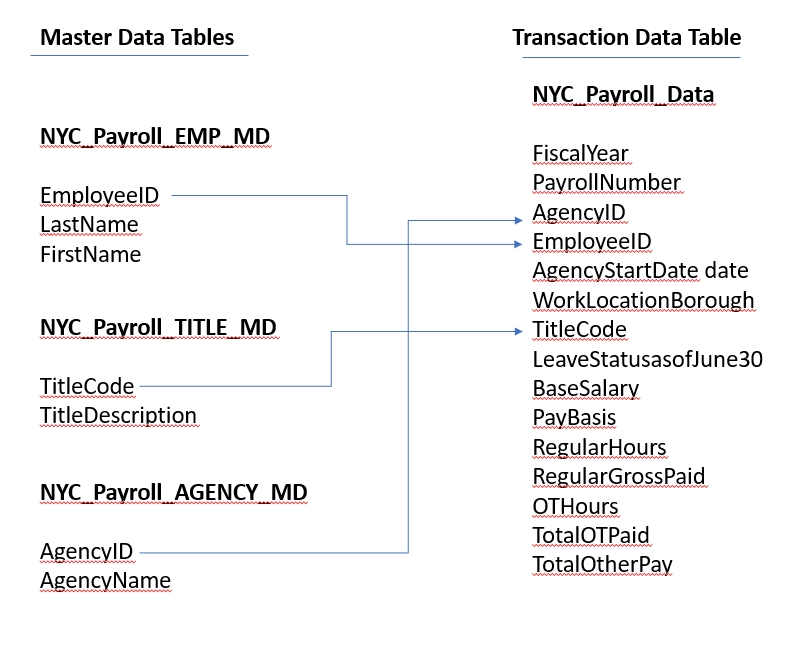

# Data Integration Pipelines for NYC Payroll Data Analytics
Project Introduction
The City of New York would like to develop a Data Analytics platform on Azure Synapse Analytics to accomplish two primary objectives:

1. Analyze how the City's financial resources are allocated and how much of the City's budget is being devoted to overtime.
2. Make the data available to the interested public to show how the City’s budget is being spent on salary and overtime pay for all municipal employees.

You have been hired as a Data Engineer to create high-quality data pipelines that are dynamic, can be automated, and monitored for efficient operation. The project team also includes the city’s quality assurance experts who will test the pipelines to find any errors and improve overall data quality.

The source data resides in Azure Data Lake and needs to be processed in a NYC data warehouse in Azure Synapse Analytics. The source datasets consist of CSV files with Employee master data and monthly payroll data entered by various City agencies.

NYC Payroll DB Schema

For this project, you'll do your work in the Azure Portal, using several Azure resources including:

- Azure Data Lake Gen2
- Azure SQL DB
- Azure Data Factory
- Azure Synapse Analytics

You'll take screenshots as proof of work for this project, so remember to collect these screenshots throughout the project steps. A checklist is provided at the end of each step so you can double-check you've collected all of the screenshot deliverables.

## Step 1: Prepare the Data Infrastructure
Setup Data and Resources in Azure

### 1. Create the data lake and upload data

### 2. Create an Azure Data Factory Resource

### 3. Create a SQL Database to store the current year of the payroll data

4. Create A Synapse Analytics workspace, or use one you already have created.

- All script in synapse branch git: synapse/sqlscript
- Create Emplyee Master Data table:

- Create Job Title Table:

- Create Agency Master table:

- Create Payroll transaction data table:

## Step 2: Create Linked Services

### 1.Create a Linked Service for Azure Data Lake

### 2.Create a Linked Service to SQL Database that has the current (2021) data

### 3. Create a Linked Service for Synapse Analytics

## Step 3: Create Datasets in Azure Data Factory

### 1.Create the datasets for the 2021 Payroll file on Azure Data Lake Gen2

### 2. Repeat the same process to create datasets for the rest of the data files in the Data Lake

- EmpMaster.csv

- TitleMaster.csv

- AgencyMaster.csv

### 3. Create the dataset for transaction data table that should contain current (2021) data in SQL DB

### 4. Create the datasets for destination (target) tables in Synapse Analytics

## Step 4: Create Data Flows

### 1.In Azure Data Factory, create the data flow to load 2021 Payroll Data to SQL DB transaction table (in the future NYC will load all the transaction data into this table).

### 2.Create Pipeline to load 2021 Payroll data into transaction table in the SQL DB

### 3. Create data flows to load the data from the data lake files into the Synapse Analytics data tables

### 4. Create a data flow to load 2021 data from SQL DB to Synapse Analytics

### 5. Create pipelines for Employee, Title, Agency, and year 2021 Payroll transaction data to Synapse Analytics containing the data flows.

### 6. Trigger and monitor the Pipelines

## Step 5: Data Aggregation and Parameterization

### 1.Create a Summary table in Synapse with the following SQL script and create a dataset named table_synapse_nycpayroll_summary

### 2.Create a new dataset for the Azure Data Lake Gen2 folder that contains the historical files.

### 3.Create new data flow and name it Dataflow Aggregate Data

### 4.Create a new Union activity in the data flow and Union with history files

### 5.Add a Filter activity after Union

### 6.Derive a new TotalPaid column

### 7.Add an Aggregate activity to the data flow next to the TotalPaid activity

### 8.Add a Sink activity to the Data Flow

### 9.Create a new Pipeline and add the Aggregate data flow

### 10.Validate, Publish and Trigger the pipeline. Enter the desired value for the parameter.

All Success

Check pipeline aggregate data in synapse table

### 11.Monitor the Pipeline run and take a screenshot of the finished pipeline run.

## Step 6: Connect your Project to Github

